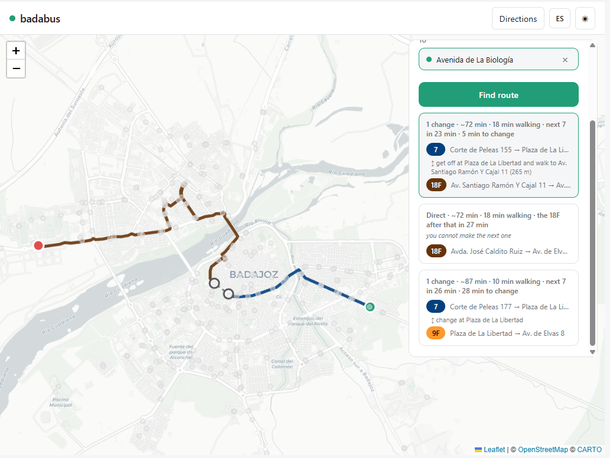

# Badabus

[](https://github.com/javierBF97/badabus/actions/workflows/ci.yml)
[](LICENSE)

An exploratory, unofficial project built on the data of the Badajoz city bus service. A map of
the stops, live arrivals and a route planner.

The operator publishes no documented API, but their arrivals page runs on an internal JSON one.
I watched the requests that page makes, reproduced those calls from the server, pulled out the
network topology and built a route engine on top of it.

Every stop shows which lines call there and when each one is due.


Any line can be seen end to end, with its direction of travel and its stops.


From one point to another you get several ways there, ordered by what the trip actually takes:
walking to the stop, waiting, and riding.



## Requirements

Python 3.10+ and the standard library only: there is nothing to install with `pip`. The map in
the browser loads Leaflet from a CDN.

## Usage

`badabus/collector.py` downloads lines, stops and line shapes, and writes the network topology
into `data/` (`paradas.json`, `lineas.json`, `red.json`, `shapes.json`, `dias.json`). To
(re)generate that data:

```bash
python -m badabus.collector
```

## Server and API

`badabus/server.py` starts a local server (`http.server`) that by default listens on localhost
only, with these routes:

| Route | What it returns |
|---|---|
| `GET /data/<resource>.json` | The static network written by the collector |
| `GET /api/parada/<id>` | Next arrivals at a stop (live) |
| `GET /api/dia` | Current day type (weekday, Saturday, or Sunday and holidays) |
| `GET /api/plan?origen=<id>&destino=<id>` | Routes between two stops or two coordinates, ordered by estimated time |
| `GET /api/buscar?q=<text>` | Geocoding of local addresses |
| `GET /api/direccion?lat=<lat>&lon=<lon>` | Reverse geocoding |
| `GET /api/config` | Settings the client needs that do not live in the code |

```bash
python -m badabus.server
```

### The server acts as a proxy

Funnelling every call through one place keeps the usage limits met and sends an identifiable
`User-Agent` every time.

```
[Browser: page on localhost:8000]
        │  fetch("/api/parada/202")   ← same origin → allowed
        ▼
[Python server on localhost:8000]
        │  urllib → operator API      ← server to server → no CORS
        ▼
[Operator API]  →  responds  →  the server passes it back to the page
```

## Configuration

Local settings live in a `.env` file at the root:

- **`CARTO_API_KEY`** — key for the base maps. Without it the map still works, but it carries a
  watermark.
- **`BADABUS_HOST`** — the address the server listens on. Left alone it listens on localhost
  only; set to `0.0.0.0` it opens to the network. Do that on trusted networks only: it is then
  exposed to anyone on that network.

## Development

```bash
python -m unittest discover -s tests      # 174 tests
pipx run ruff==0.15.20 check .            # linter, same version as CI
```

CI runs both on every push and pull request, and the tests on Python 3.10, 3.11 and 3.12. The
tests use `unittest`, from the standard library: the project's "no dependencies" holds for them
too.

---

# Engineering log

What follows are the decisions, the measurements and the biases I had to correct.

## 1. Getting the data

Watching the network traffic of their arrivals page, I found the GET parameters it uses:
`?action=lineas`, `paradas`, `tiempos` and `correspondencias`. Those give the stops of each line
in order, the live arrivals, the current day type and which lines run. The line shapes live on a
different host and are downloaded separately, as a polyline of points per direction.

To estimate how long a ride takes I measured the fleet's own **commercial speed**: every arrival
carries the metres the bus has left and the minutes it will take, so `metres / minutes` gives it
directly. Across dozens of buses the median was **~20 km/h**, then corrected by a detour factor
when going from straight-line distance to the real course.

## 2. Geocoding: choosing the address engine

Nobody plans a trip in stops. They plan it as "I want to get to such a street". Translating one
into the other meant comparing three options:

| | Nominatim (OSM) | Cartociudad (IGN) | Photon (Komoot) |
|---|---|---|---|
| Half a word | ✗ | ✗ | **✓** |
| Autocomplete | Forbidden | Allowed | **A stated feature** |
| Missing street number | Returns the street | **Returns nothing** | Returns the street |
| Measured time | 274-2,000 ms | 440-790 ms | **185-474 ms** |

I chose **Photon**, which is built for searching as you type. **Cartociudad** stays as a fallback:
it only comes in when Photon finds nothing, and it brings data from another source — the land
registry — instead of repeating the same, which is what Nominatim would have done, drawing on
OpenStreetMap like Photon.

Cartociudad had a surprise in it. Measured over fourteen real streets, two returned nothing: if
the street number is not in its database it answers empty rather than offering the street. And given
a number that does not exist it silently substitutes the nearest one — I asked for 88 and got 58.

Both are queried from the server, so their usage limits are met in one place and every call goes
out identified.

## 3. Making the route search fast

The first algorithm crossed every origin stop with every destination stop. With the four nearest
at each end it had room to spare, but four stops close together tend to serve the same lines: a
line passing 500 m away never entered. Widening the radius to 1 km let them all in, and with them
thousands of pairs: **2,700 ms**.

I tried three things:

- **Enumerating every possible path.** It got worse, **15,000 ms**, and it drowned the good
  options among hundreds of variants of the same trip.
- **Searching backwards, from the destination.** Faster when the destination has fewer stops than
  the origin (6 ms against 11 ms), but swap the ends and the normal search wins. Winning both ways
  would mean keeping both directions in memory.
- **Searching in rounds, the one I kept.** A round is one more bus, and it sweeps the network once
  whether you start from one stop or from seventy. Worst case down to **25 ms**.

Keeping few paths per stop beats enumerating everything, because it does not dilute the useful
alternatives among redundant variants of the same trip.

Then came another bottleneck. Live arrivals were requested stop by stop, one after another: with
seventy stops, **8 seconds**. Now they go out in parallel, and only where some route has you
board: **half a second**.

## 4. The time model

The total — walk, wait, ride — went through several passes to correct early assumptions that
were skewing the ranking.

### Transfers, measured

At first a transfer added no time at all, so routes with a transfer beat the same route without
one just by saving half a minute of walking. Since the service gives arrivals for **any** stop,
the wait at the transfer can be read live from the estimated arrival of the first bus.

Asking for every possible transfer stop cost **1,135 ms**, but only the stops of the finalist
routes matter: a couple against forty-six options. I make that call in a **second pass, after
ordering**: down to **805 ms**, and accurate where it counts.

### The vehicle, not the stop

The planner suggested walking twenty minutes to a far stop because it announced a 0 min wait,
ignoring one nearby announcing 11 min. The zero at the far stop was a bus going past right then,
impossible to reach after a twenty-minute walk. The next one through there was precisely the one
the near stop announced at 11 min.

The fault was treating each stop on its own. Now an observed arrival reconstructs **that vehicle's
passage along the whole line**: it adds the ride forward and subtracts it backward, ruling out the
buses that have already gone past you.

I checked it afterwards on seven random origin-destination pairs: in none of them does it now pick
a stop you reach later.

### Dominance, with one exception

If a route arrives sooner, walks you less **and** has fewer transfers than another, the loser goes.
That needs no view on what a minute walking is worth against a minute waiting; it is enough that
one wins on all three.

There was one exception: **a route whose wait is unknown cannot rule out one whose wait is known.**
It can be ordered ahead, but erasing a certainty on the strength of an estimate moves the error
somewhere else instead of fixing it.

## 5. Frequencies, typed in by hand

The API reports the next bus, never the one after. To close an estimate when you miss the first
one, I typed the timetables the operator publishes as images into a local file,
`data/frecuencias.json`. The engine takes a fixed frequency, a frequency that changes by time
band, and loose departure times:

```jsonc
{
  "lineas": {
    "EJEMPLO-1": {                      // fixed frequency: the common case
      "LV": { "desde": "07:00", "hasta": "23:20", "frecuencia_min": 20,
              "cabeceras": { "Cabecera Norte": [0, 20, 40] } }
    },
    "EJEMPLO-2": {                      // the frequency changes through the day
      "LV": { "desde": "07:00", "hasta": "23:10", "frecuencia_min": [15, 20],
              "tramos": { "Cabecera Norte": [
                { "desde": "07:00", "hasta": "13:00", "minutos": [0, 15, 30, 45] },
                { "desde": "13:00", "hasta": "23:00", "minutos": [0, 20, 40] }
              ] } }
    },
    "EJEMPLO-3": {                      // no pattern: individual departures
      "LV": { "desde": "06:30", "hasta": "22:45",
              "salidas": { "Cabecera Norte": ["06:30", "08:00", "09:30"] } }
    }
  }
}
```

The keys are in Spanish because that is how they are in the code: `desde` and `hasta` are the
first and last service of the day, `frecuencia_min` the minutes between buses, `cabeceras` the
minutes past the hour a line leaves each terminus, `tramos` the time bands when that changes
through the day, and `salidas` the individual departure times when there is no pattern at all.

Each line is indexed by day type (`LV` weekdays, `SAB` Saturdays, `DOM` Sundays and holidays).
The file says **what timetable a line follows when it runs**; whether it runs today is answered by
the live data, which is the reliable source.

**This file is not in the repository**: it belongs to the operator and this project does not
redistribute their data, same as the rest of `data/`. The application works without it — the waits
stay unknown, the cards say so, and it falls back the same way it does when the live data fails.
Published as images with no version, the timetables expire without warning; the `transcrito` field
records the date each was copied.

## 6. Transfers on foot

Requiring both lines to call at the same shelter threw away dozens of useful combinations: in real
life you cross the street or walk fifty metres and take another line.

The first idea was to keep the nearest stop of each line, but measuring it showed the flaw: a
single line can have seventeen stops within a kilometre, opposite pavements included. At the
destination it was worse, where four nearby stops served the same lines and the algorithm could
make you walk further than you needed to on getting off.

So instead of pre-selecting, evaluate them all and let the ranking decide. To keep that fast I
precompute a neighbour graph when the server starts, comparing every stop with the rest; it takes
about 30 ms and stays in memory.

I measured the walking radius rather than picking one:

| Radius | Neighbour pairs | Trips that improve | Trips that get worse |
|---|---|---|---|
| 200 m | 427 | 10 of 19 | 0 |
| **300 m** | **906** | **12 of 19** | **0** |
| 400 m | 1,578 | 12 of 19 | 1 |

The median gain across the trips that improve is **8.7 minutes**, the same at all three radii.

**300 m is where it turns**: 400 m does not improve a single extra trip, doubles the computing
work and, on top of that, makes one result worse.

The algorithm keeps only a few paths per stop and drops the rest. With transfers on foot six times
as many routes compete for those same slots, so at the original four the good ones fell off the
list and the number had to go up.

One more rule: **no walking backwards**. If the bus you just got off had already called at the
stop you are walking to, you are undoing your own trip. Crossing the street is fine, because those
are different stops for the opposite direction.

The price of allowing transfers on foot is that the median search goes from **44 ms to 272 ms**.
The gain shows most in areas with few buses, which is exactly where the feature earns its keep.

## 7. Limits

**Walking estimates.** Walking distance is the straight line multiplied by a detour factor of
**1.3**. To check it I used the bus line shapes themselves as a stand-in for the street network.
The real factor has a **median of 1.21 and a p90 of 1.93**, so 1.3 holds up for the ordinary case.
The tail is where it does not: of 882 pairs of stops less than 300 m apart, **75 need more than
2x, and eight of them more than 5x**. A real one: two stops 87 m apart in a straight line are
619 m apart on foot, because of how the surroundings are laid out. In those tail cases the
estimate fails, and the application has no routing engine to notice.

**Static traffic.** The operator publishes no GPS positions for the fleet. The "live time" is the
output of an internal formula: distance divided by a constant speed, with a **~11 %** spread that
comes from rounding to whole minutes. Inferring real traffic speed from that number is circular.
So the planner assumes a flat 20 km/h for every line at every hour, blind to rush hours and to
blocked avenues.

Neither limit makes the times useless: their job is to **order alternatives**, and for that the
model holds. They are not a clock.

## License

MIT. See [LICENSE](LICENSE).

## Notice

A personal tool that consumes public data from the Badajoz city bus service. It is not an official
product and it does not redistribute their data. Use responsibly.
