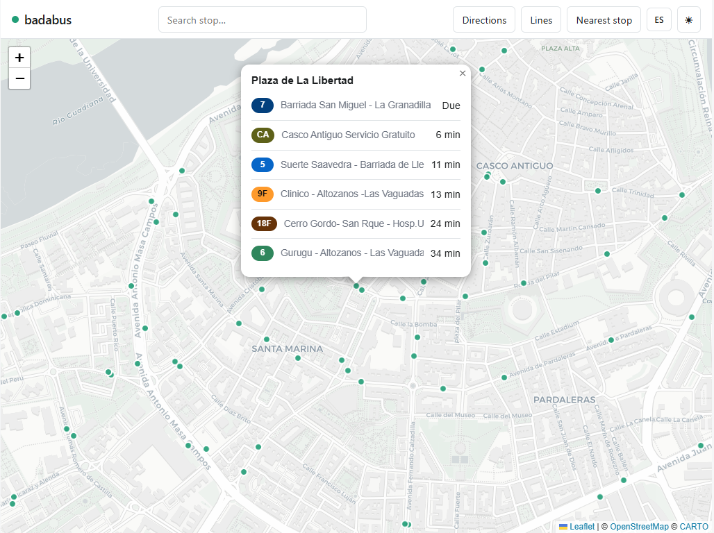
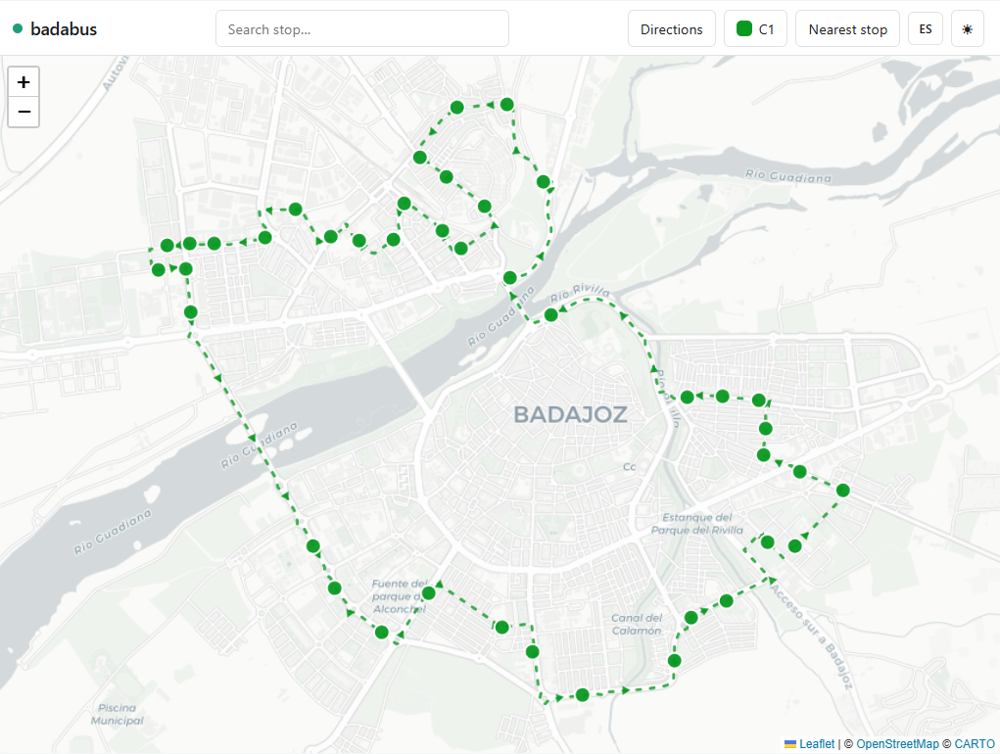

# badabus

Proyecto exploratorio, no oficial, sobre los datos del servicio de autobús urbano
de Badajoz. Un mapa con las paradas, los tiempos de paso en vivo y un planificador
de rutas; en castellano o en inglés, y en claro u oscuro.

Cada parada dice qué líneas pasan y en cuánto. Ese dato es el único de todo el
proyecto que viene medido y no estimado.



De un punto a otro se ofrecen varias formas de llegar, ordenadas por lo que se tarda
de verdad: andar hasta la parada, esperar y viajar. Cuando no se puede cerrar un
total, se dice —*"you cannot make the next one"*— en vez de enseñar un número que no
se sostiene. De eso trata media documentación de más abajo.


Y cualquier línea puede verse entera, con su sentido de marcha y sus paradas.



## Requisitos
Python 3.10+ (solo biblioteca estándar; sin `pip install`).

## Uso
`badabus/collector.py` descarga líneas, paradas y trazados y guarda la red en `data/`
(`paradas.json`, `lineas.json`, `red.json`, `shapes.json`, `dias.json`). Para (re)generar los datos:
```
python -m badabus.collector
```

## Servidor
`badabus/server.py` levanta un servidor local (`http.server`) que por defecto solo
acepta conexiones de este equipo, con estas rutas:

- `GET /data/<paradas|lineas|red|shapes|dias>.json` — sirve la red generada por el recolector.
- `GET /api/parada/<id>` — próximas llegadas a una parada (dato en vivo).
- `GET /api/dia` — tipo de día vigente (laborable, sábado o domingo/festivo).
- `GET /api/plan?origen=<id>&destino=<id>` — rutas entre dos paradas, con transbordos si hacen
  falta, ordenadas por tiempo estimado y con la espera del próximo bus. Cada extremo acepta
  también coordenadas (`origen_lat`/`origen_lon`), para partir de una dirección o de un punto
  del mapa en vez de una parada.
- `GET /api/buscar?q=<texto>` — direcciones de Badajoz que coinciden con el texto.
- `GET /api/direccion?lat=<lat>&lon=<lon>` — nombre del sitio que hay en unas coordenadas.
- `GET /api/config` — ajustes que el navegador necesita y no viven en el código.

Arrancarlo:
```
python -m badabus.server
```

### El servidor actúa como proxy para evitar el CORS

```
[Navegador: página en localhost:8000]
        │  fetch("/api/parada/202")   ← MISMO origen (localhost:8000) → permitido sin más
        ▼
[Nuestro servidor Python en localhost:8000]
        │  urllib → https://tubasa.autobus.cloud/...   ← servidor→servidor, SIN navegador → sin CORS
        ▼
[API del servicio]  →  responde los datos  →  el servidor se los devuelve a la página
```

## Configuración
Los ajustes locales van en un `.env` en la raíz, que no se sube al repositorio. `.env.example`
lista los disponibles:

- `CARTO_API_KEY` — clave gratuita de los mapas base. Sin ella el mapa funciona igual, pero
  se ve con marca de agua.
- `BADABUS_HOST` — dirección en la que escucha el servidor. Sin tocarlo solo atiende a este
  equipo. Puesto a `0.0.0.0` se abre a la red local, para probar la app desde el móvil, e
  imprime al arrancar la dirección a la que conectarse. Hazlo solo en redes de confianza:
  queda expuesta a quien esté en esa red.

## Cómo se ha construido

Lo que sigue es la bitácora del proyecto, y se lee como tal: cuenta lo que se probó, lo
que se midió y lo que salió mal, **sin borrar los pasos intermedios**. Casi nada salió
como se esperaba, y esa es la parte que merece la pena contar.

## Exploración
Esta herramienta nace de explorar los datos del servicio de autobús urbano de
Badajoz. El servicio no publica una API documentada, pero su web de tiempos
consume una API JSON interna. Observando las trazas de red (DevTools → *Network*)
al usar la web se identificaron sus endpoints:

- `?action=lineas` — listado de líneas.
- `?action=paradas&linea=<id>` — paradas de una línea, en orden.
- `?action=tiempos&parada=<id>` — próximas llegadas a una parada (en vivo).
- `?action=correspondencias&linea=<id>` — transbordos por parada y tipo de día.

`badabus/bus_data_api.py` reproduce las peticiones GET de `lineas`, `paradas`,
`tiempos` y `correspondencias`. De `correspondencias` se sacan **qué tipo de día es
hoy** (laborable, sábado o domingo/festivo) y **qué líneas circulan cada día**; los
transbordos de una ruta se deducen de las líneas que pasan por cada parada.

Aparte de esa API, la **geometría de los recorridos** (trazados) vive en otro host:
la web de planos de línea consume `https://tubasa.eu/planos_de_lineas/datos/shape<id>.json`,
que devuelve la polilínea de una línea como array de puntos (`shape_pt_lat`,
`shape_pt_lon`, `sentido`). `badabus/bus_data_api.py` (`fetch_shape`) la baja y
`parse_shape` la agrupa por sentido para poder dibujar el trazado en el mapa.

La duración de un trayecto se estima a partir de una velocidad medida de los propios
datos: cada llegada de `tiempos` trae los metros que le faltan al bus y los minutos que
tardará, así que `metros/minutos` da su velocidad comercial. Una muestra de decenas de
buses dio una mediana de ~20 km/h, que es la que usa el planificador para ordenar las
rutas, corregida por un factor de sinuosidad al pasar de la distancia en línea recta al
recorrido real.

El tiempo andando se estima con el mismo criterio: la distancia en línea recta corregida por
un factor de callejeo, porque el peatón tampoco atraviesa edificios. Sirve para ordenar
alternativas y dar una idea, no es un tiempo real de caminata.

## Direcciones
Nadie piensa un viaje en paradas: piensa en "quiero ir a tal calle". Traducir una cosa en la
otra necesita un geocodificador, y elegirlo llevó su comparación.

**Se empezó con Nominatim**, el de OpenStreetMap. Funciona, pero su política **prohíbe
expresamente el autocompletado** y limita a una petición por segundo. De ahí salían el mínimo
de cuatro caracteres, la espera antes de consultar y el hueco forzado entre peticiones: no
eran decisiones de diseño, eran su reglamento. El síntoma se veía escribiendo media palabra —
"Condes de Barc" devolvía **cero resultados**.

**Se probó Cartociudad**, del Instituto Geográfico Nacional. Tiene portales oficiales con
número, que OpenStreetMap no siempre trae, y no prohíbe el autocompletado. Pero medido sobre
catorce calles reales, **dos de cada catorce no devolvían nada**: cuando el número de portal
no está en su base, responde vacío en lugar de ofrecer la calle. Y con el número inexistente
sustituye por el más cercano sin avisar — se pidió el 88 y devolvió el 58.

**Se quedó Photon** (Komoot, también sobre OpenStreetMap). Está construido para buscar
mientras se escribe, y eso figura entre sus funciones declaradas:

| | Nominatim | Cartociudad | Photon |
|---|---|---|---|
| Media palabra | ✗ | ✗ | **✓** |
| Autocompletado | Prohibido | Permitido | **Función declarada** |
| Número inexistente | Da la calle | **Vacío** | Da la calle |
| Tiempo medido | 274-2.000 ms | 440-790 ms | **185-474 ms** |

**Cartociudad se queda de respaldo**, no de repuesto: entra solo cuando Photon no encuentra
nada, y aporta datos de otra fuente —el catastro— en vez de repetir los mismos. Nominatim
salió del proyecto por eso mismo: bebe de OpenStreetMap igual que Photon, así que como
segunda opinión no aportaba nada.

Ambos se consultan **desde el servidor, nunca desde el navegador**, igual que se hace de
proxy con los tiempos: así la identificación y la cortesía con el servicio se cumplen en un
único sitio. Y aunque Photon permita buscar tecla a tecla, **una petición por pulsación sería
abusar** de algo gratuito: se mantiene una espera corta y una caché de lo ya buscado.

Partiendo de una dirección, la parada más cercana no siempre es la mejor: a 90 m puede haber
una de una línea que va al lado contrario, y a 250 m otra que lleva directo. Por eso se
prueban varias paradas próximas y se deja que el ranking decida, con el tiempo andando ya
sumado al total.

## Cómo se buscan las rutas
Esta parte se ha medido más que decidido, y conviene dejar constancia de lo que se probó,
porque casi nada salió como se esperaba.

El planificador buscaba un par origen-destino cada vez. Mientras solo se miraban las cuatro
paradas más cercanas iba sobrado, pero cuatro paradas juntas suelen ser de las mismas
líneas, así que había líneas que no se consideraban nunca: la parada de una línea a 500 m
podía ser la vigésima más próxima y no entrar jamás en la búsqueda. Al ampliar a todas las
de 1 km, los pares pasaron a ser miles y el coste se disparó a **2.700 ms**.

Se probaron tres caminos:

- **Desde todos los orígenes a la vez, enumerando todas las rutas.** Salió peor:
  **15.000 ms**, y encima con resultados de menos calidad. Al enumerarlo todo, las primeras
  posiciones se llenaban de variantes del mismo viaje y las opciones buenas desaparecían.
- **Hacia atrás, partiendo del destino.** Más rápido cuando el destino tiene menos paradas
  que el origen (6 ms frente a 11), pero invirtiendo los extremos gana la búsqueda normal.
  Ganar siempre exige mantener las dos direcciones, y son milisegundos que no se notan.
- **Por rondas, recordando solo unas pocas formas de llegar a cada parada.** Una ronda es
  un bus más y recorre la red una sola vez, se salga de una parada o de setenta. **25 ms**
  en el peor caso.

Se quedó la tercera. Lo interesante es que recordar pocos caminos no es un mal menor que se
acepta a cambio de velocidad: **da mejor resultado que enumerarlo todo**, porque no ahoga
las alternativas buenas entre variantes de un mismo viaje.

Después apareció otro cuello de botella, este de cosecha propia: los tiempos en vivo se
pedían parada por parada y en fila, así que con setenta paradas eran **8 segundos**. Se
piden solo donde alguna ruta hace subir, y todas a la vez: **medio segundo**.

Por último, de 216 rutas encontradas en una consulta real, **195 eran la misma combinación
de líneas cogida en otra parada**. Se deja una por combinación, la más rápida. Y cuando dos
líneas recorren exactamente el mismo tramo, en lugar de descartar una se enseñan las dos:
sirve la primera que pase, y saberlo acorta la espera.

## Lo que no se sabe, no se inventa
Esta parte ha ido por pasos, y cada uno salió de comprobar el anterior. Se cuentan todos
porque el camino explica el resultado mejor que el resultado solo.

**Paso 1 — la espera desconocida valía cero.** El total era andar + esperar + viajar, y
cuando la espera no se sabía se sumaba un cero. Cómodo, y equivocado en una dirección
concreta: **premiaba a las rutas peor conocidas**, porque no tener dato salía más barato que
tenerlo.

**Paso 2 — medirlo.** De 216 rutas de una consulta real, 100 tenían un bus que pasaba antes
de que llegaras andando y 16 no tenían dato ninguno: **el 54 % llevaba un total que no se
sostenía**, y las cuatro que se ofrecían primero eran todas de ese grupo. El sesgo no era
teórico, mandaba en la pantalla.

**Paso 3 — dejar de afirmar lo que no se sabe.** La espera pasó a tener tres estados en vez
de un número siempre, y el total a mostrarse como **"desde X min"** —el suelo real, andar más
bus— cuando no se podía cerrar. Menos vistoso y más cierto. *Esto sigue siendo lo que se ve
si no hay fichero de frecuencias.*

**Paso 4 — aparecieron las frecuencias.** El operador publica cada cuánto pasa cada línea
(ver más abajo), y con eso casi todo se cierra:

| Situación | Qué se puede afirmar |
|---|---|
| El bus anunciado te da tiempo | El total completo, con su espera |
| **Se te escapa** | El siguiente va una frecuencia después: espera exacta, avisando de que no coges el primero |
| **No hay dato de paso** | La espera no se sabe, pero la frecuencia la acota: *"hasta 20 min"* |
| **La línea ya no circula** | Se dice tal cual, en vez de fingir que falta un dato |

Lo segundo no es una suposición: si se sabe cuándo pasa el que se pierde y cada cuánto van,
se sabe cuándo pasa el siguiente. Es aritmética sobre dos datos reales.

**Paso 5 — el mismo agujero, un piso más abajo: el transbordo.** Al cerrar la espera de
salida se hizo evidente que la del transbordo **no se contaba en absoluto**. Bajarse y coger
otro bus salía gratis, así que aparecían rutas con transbordo por delante de la misma ruta
sin él, por ganar medio minuto de caminata.

El primer intento fue suponer **media frecuencia**, que es lo esperable al caer en un punto
cualquiera del horario. Mejor que cero, pero seguía siendo una suposición.

**Paso 6 — no hacía falta suponerla.** El servicio da los tiempos de **cualquier** parada,
no solo la de origen: en el transbordo también se sabe cuándo pasa la otra línea. Con eso y
la hora estimada de llegada sale la espera de verdad, y si ese bus se escapa —la llegada es
una estimación, así que se le exige el mismo margen que a la salida— se salta al siguiente
sumando la frecuencia.

Preguntar los tiempos de todas las paradas de transbordo costaba **1.135 ms**. Pero solo
importan las de las rutas que acaban mostrándose, y esas son **un par frente a cuarenta y
seis**. Así que se consultan **en una segunda vuelta, después de ordenar**: 805 ms en vez de
1.135, y exacto donde importa. Preguntar menos y saber más.

Media frecuencia queda como respaldo cuando no hay dato en vivo, y una cifra fija cuando
tampoco hay frecuencia. Cero es la única respuesta que seguro está mal.

**Paso 7 — verificar destapó cuatro fallos, todos de la misma familia.** No contar algo hacía
parecer mejor a una ruta:

- Una línea **fuera de su horario** salía la primera, por no tener espera que contar, por
  delante de otra que sí se podía coger. Ahora no se ofrece — salvo que no quede ninguna, y
  entonces se explica por qué en vez de decir que no hay ruta, que sería falso.
- Dos líneas se **fusionaban como intercambiables** aunque una no circulara.
- El filtro de "mucho peor" se medía **contra esa ruta imposible**, y descartaba las buenas
  por lentas.
- Una regla descartada por medirla en una sola consulta —"no ofrecer una ruta que es otra más
  corta con buses de propina"— **sí hacía falta**: apareció en cuanto se probó otro trayecto.

**Paso 8 — y una regla que no necesita opinión.** Si otra ruta llega antes, te hace andar
menos **y** con menos transbordos, esta no es una alternativa: no hay a quien le convenga.
Descartarlas no exige decidir cuánto vale un minuto andando frente a uno esperando —eso sería
opinable—, basta con que otra gane en las tres.

**Paso 9 — el mismo autobús contado como dos.** Una consulta mandaba a andar veinte minutos
hasta una parada lejana teniendo una al lado. Mirando los datos en vivo se veía por qué: la
cercana anunciaba **11 minutos** y la lejana **cero**, y cero gana a once en cualquier
comparación. Pero entre las dos hay **6,8 minutos de trayecto** de esa misma línea, así que
el cero de la lejana era un autobús que estaba pasando por allí en ese momento, imposible de
alcanzar después de veinte minutos andando. El siguiente que pasa por la lejana es justo el
que la cercana anuncia a 11 minutos: 11 + 6,8 = 18. **Andar veinte minutos para coger el bus
que tienes al lado.**

El fallo estaba en tratar cada parada como si tuviera su propio servicio. Una llegada
observada en una parada no informa solo de esa parada: reconstruye **el paso de ese vehículo
por toda la línea**, hacia adelante sumando el trayecto y hacia atrás restándolo. Con eso la
espera deja de ser el número que anuncia la parada y pasa a ser *cuándo pasa por aquí el
primer autobús al que llego a tiempo*. Un bus que ya ha pasado deja de contar, esté donde
esté.

En el caso de arriba el resultado coincidió con lo que se veía a ojo, que es la mejor señal:

| | Antes | Ahora |
|---|---|---|
| Total | 42 min | **35 min** |
| Andando | 20 min | 19 min |

y la segunda opción pasó a ser un transbordo de 36 minutos con solo 10 andando: las dos
paradas que cualquiera del barrio habría dicho de memoria.

Comprobado después sobre **siete pares origen-destino al azar**, en ninguno se elige una
parada que llegue más tarde. Uno saltó en la revisión y resultó ser un fallo *del
comprobador*, no del ranking: comparaba esperas pedidas con un minuto de diferencia, que es
el mismo error que este paso viene a arreglar, cometido al verificarlo.

**Paso 10 — y la caminata contada dos veces.** Lo anterior destapó una incoherencia que
llevaba ahí desde el principio, en las dos ramas del cálculo: cuando **se perdía** el
autobús se restaba lo andado, y cuando **se cogía**, no. Un viaje de 32 minutos se anunciaba
como **48**. Había un test que fijaba el número equivocado, así que el fallo estaba escrito y
protegido: se corrigió explicando por qué, y se añadió el caso complementario para que las
dos ramas no puedan volver a discrepar.

**Paso 11 — el sesgo del Paso 1 seguía vivo, un piso más abajo.** Una revisión externa
lo destapó: el Paso 3 dejó de *afirmar* la espera desconocida, pero el número que se
usaba para **decidir** seguía siendo cero. Y cero no es neutro, es el mejor valor
posible, así que la ruta peor conocida ganaba siempre. Medido: una línea con dato en
vivo, cierta en 15 minutos, **desaparecía de la pantalla** frente a otra sin dato cuyo
suelo era 3 —y de la que se sabía, y se escribía en la tarjeta, que podía tardar 20—.
No quedaba segunda: la regla de descartar dominadas la borraba.

El arreglo son dos números donde antes había uno. **El que se enseña** sigue siendo el
suelo honesto, con su "desde X min". **El que decide** usa la espera que cabe esperar:
media frecuencia si se publica —la misma regla que el Paso 6 ya aplicaba a los
transbordos—, y 15 minutos si no, que es la mitad de la frecuencia mediana publicada.

Y una segunda regla, porque la primera no bastaba: **una ruta cuya espera no se sabe no
puede descartar a una que sí la sabe.** Puede ir por delante, que es lo que dice el
valor esperado, pero borrar una certeza apoyándose en una estimación es cambiar de
sitio el mismo error, no arreglarlo.

Lo que más enseña de este paso no es el fallo, es dónde estaba: el README lo había
diagnosticado bien, con estas palabras —"premiaba a las rutas peor conocidas"—, y la
corrección se aplicó a la capa que se ve. **Diez pasos argumentando un sesgo no impiden
dejarlo dentro**, si se arregla la frase en vez de la decisión.

## Frecuencias de paso
El servicio no publica sus frecuencias en ninguna API: están en su web como **imágenes**, una
por línea, con la hora de inicio, la de fin, cada cuánto pasa y en qué minutos sale de
cabecera. Ese dato es lo único que permite estimar cuándo pasa el **siguiente** bus, porque el
endpoint de tiempos solo informa del próximo.

Por eso ese dato se transcribe a mano a **`data/frecuencias.json`**, que **no se incluye
aquí**: es del operador y este proyecto no lo redistribuye, igual que el resto de `data/`.
Quien quiera esa precisión lo crea con el formato de abajo.

**La aplicación funciona sin ese fichero.** Sin él las esperas quedan como desconocidas y las
tarjetas lo dicen ("desde X min · sin datos de paso"), que es el mismo camino que ya se sigue
cuando el dato en vivo falla. Con él, los tiempos se cierran.

Cada línea aparece en una de tres formas, según cómo publique el operador su horario:

```jsonc
{
  "lineas": {
    "EJEMPLO-1": {                      // frecuencia fija: lo más común
      "LV": { "desde": "07:00", "hasta": "23:20", "frecuencia_min": 20,
              "cabeceras": { "Cabecera Norte": [0, 20, 40] } }
    },
    "EJEMPLO-2": {                      // la frecuencia cambia durante el día
      "LV": { "desde": "07:00", "hasta": "23:10", "frecuencia_min": [15, 20],
              "tramos": { "Cabecera Norte": [
                { "desde": "07:00", "hasta": "13:00", "minutos": [0, 15, 30, 45] },
                { "desde": "13:00", "hasta": "23:00", "minutos": [0, 20, 40] }
              ] } }
    },
    "EJEMPLO-3": {                      // sin patrón: horas de salida sueltas
      "LV": { "desde": "06:30", "hasta": "22:45",
              "salidas": { "Cabecera Norte": ["06:30", "08:00", "09:30"] } }
    }
  }
}
```

Cada línea se indexa por tipo de día (`LV`, `SAB`, `DOM`), como `dias.json`. El fichero dice
**qué horario sigue una línea cuando circula**; de si circula hoy sigue respondiendo el dato en
vivo, que es más fiable: algunas líneas solo salen ciertos domingos y eso no se modela.

Se publican como imágenes sin número de versión, así que **caduca sin avisar**. El campo
`transcrito` guarda la fecha en que se copió.

## Transbordar andando
Un transbordo exigía que las dos líneas parasen **en el mismo sitio**. En la calle no
funciona así: te bajas, cruzas o andas cincuenta metros, y coges otra línea.

### Primer diseño, y por qué se cayó

La idea inicial era quedarse con **la parada más cercana de cada línea**: una por línea, y a
otra cosa. Al medirla no se sostenía.

Una sola línea puede tener **diecisiete paradas a menos de un kilómetro**, incluidas las dos
aceras de la misma calle, que van en sentidos opuestos: quedarse con la más próxima podía
elegir el sentido contrario. En el destino era peor — sus cuatro paradas servían las mismas
líneas, así que la regla las reducía a una, y ahí sí importa cuál, porque cambia lo que andas
al bajar. En total perdía **37 combinaciones de líneas**.

Se descartó antes de escribir nada. Lo que quedó fue lo contrario: no elegir, sino mirarlas
todas y dejar que el orden decida.

### El grafo de vecindad

Hace falta saber qué paradas se tocan andando. Es **lo contrario de buscar paradas cercanas a
un punto**: allí se mide desde un sitio suelto y hay que recorrer las 369 en cada llamada;
aquí interesa la red entera de una vez, y no cambia entre consultas.

Así que se calcula **una sola vez al arrancar**, comparando cada parada con las demás. Son
unos 30 ms, y el resultado crece rápido con el radio:

| Radio | Pares de paradas vecinas |
|---|---|
| 100 m | 154 |
| 200 m | 427 |
| 300 m | 906 |
| 400 m | 1.578 |

### Afinar el radio: medido dos veces

No se eligió a ojo. Se barrieron **cinco radios contra cuatro cupos** sobre pares de origen y
destino al azar, mirando en cuántos viajes mejoraba el tiempo, en cuántos empeoraba y cuánto
se ganaba.

La primera vez salió **200 m**. Pero ese barrido comparaba solo **andar + bus**, porque
entonces no había datos de espera fiables. Al rehacerlo con las esperas dentro, el óptimo se
movió:

| | Sin esperas | Con esperas |
|---|---|---|
| Radio | 200 m | **300 m** |
| Viajes que mejoran | 47 % | **63 %** |
| Ganancia mediana | 6,1 min | **8,7 min** |

Tiene sentido: el coste de andar no cambió, pero el premio sí. Andar trescientos metros para
coger una línea que pasa cada veinte minutos, en vez de una que pasa cada hora y media, ahora
se paga solo. **400 m no aporta nada sobre 300 y cuesta el doble**, así que el codo es real y
no una meseta.

Las esperas se modelan como **media frecuencia** para afinar, también la del primer bus, de
forma que la medición no dependa del minuto en que se lance. En uso real esa primera espera
sale del dato en vivo.

### Y el cupo, que no es un detalle

Con transbordos a pie salen **seis veces más rutas** compitiendo por las mismas plazas por
parada. Con el cupo en 4 hay viajes que **empeoran**: las buenas se caen de la lista. Con 8
desaparecen y la ganancia ya está al máximo; subir a 16 o 32 solo cuesta.

Es la tercera vez que aparece el mismo patrón en este proyecto: **ampliar lo que se busca sin
ampliar lo que se recuerda empeora el resultado.**

### Las reglas del viaje

**No se anda hacia atrás.** Si el bus del que acabas de bajar ya había pasado por esa parada,
ir hasta ella es deshacer camino. Cruzar la calle sí vale: las dos aceras son paradas
distintas y a veces el sentido que quieres es el otro.

**Y esos metros cuentan** — en el total y en el reloj que decide si llegas al segundo bus. Si
no, volveríamos a hacer parecer gratis lo que no lo es, que es el error que este proyecto
lleva corrigiendo desde el principio.

Buscar pasa de 44 a **272 ms**. Es el precio de mirar seis veces más rutas, y donde más se
nota es en las zonas con poca frecuencia, que es justo donde hacía falta.

## Limitaciones
Los minutos que se enseñan salen de estimaciones, y conviene decir de cuáles.

**No hay ruteador peatonal.** Cada caminata es la distancia en línea recta multiplicada por
un factor de callejeo de 1,3. Para comprobarlo se usaron los trazados de los propios
autobuses como mapa de calles —solo cruzan el río por los puentes, así que llevan dentro los
obstáculos de la ciudad—: el factor real tiene una **mediana de 1,21 y un p90 de 1,93**, de
modo que 1,3 está bien elegido para el caso corriente. Lo que no cubre es la cola. De 882
parejas de paradas a menos de 300 m, **75 pasan de 2x y ocho de 5x**: medianas de avenida,
vías y el río. Un caso real, dos paradas del mismo paseo: **87 m en línea recta, 619 m
andando de verdad**. Ahí la estimación se queda corta y la aplicación no tiene forma de
saberlo.

*(La primera versión de esa medición salió mal y decía factores de hasta 595x. Eran paradas
enfrentadas a siete metros, la de ida y la de vuelta: los dos trazados van por carriles
distintos y la rejilla no los cosía, así que el grafo estaba partido y se medía el fallo de
montaje. Cosiendo los trazados a menos de 25 m salieron las cifras de arriba.)*

**No hay tráfico real.** El servicio no publica dónde están sus vehículos, solo cuándo pasa
el próximo por cada parada. Y ese dato resultó ser **una fórmula**, no una medición:
distancia dividida por una velocidad fija. Los metros por minuto dieron una mediana de 334,
p10 de 320 y p90 de 391, y el 11 % de desviación se explica por el redondeo a minutos. Así
que deducir la velocidad real de su API es circular. El planificador usa 20 km/h para todas
las líneas y a todas las horas: no distingue hora punta, ni una avenida de una calle del
casco antiguo. **Esto no se puede resolver desde fuera**, salvo observando llegadas durante
semanas para construirse un histórico propio.

Ninguna de las dos cosas hace inútiles los tiempos: sirven para **ordenar alternativas**, que
es para lo que están. Pero no son un reloj.

## Aviso
Herramienta personal que consume datos públicos del servicio de autobús urbano de
Badajoz. No es un producto oficial y no redistribuye sus datos. Uso responsable.
